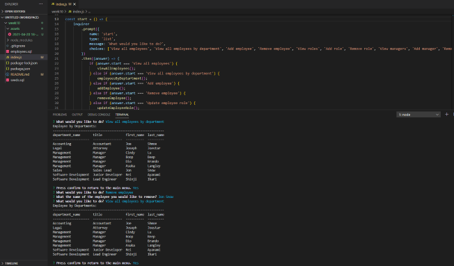

# MyWorkplaceTracker

## Table of Contents
* [Description](#description)
* [Installation](#installation)
* [Usage](#usage)
* [License](#license)
* [Questions](#questions)

## Description
This application serves as a Content Management System. Through a series of prompts, the user is able to view and edit the employees, roles, and departments of a workplace.

## Installation
To install this application, add this repository to a folder of your choosing. Run the employee schema to initialize the database. Run npm install to acquire the necessary dependencies.

## Usage
To utilize this application, connect to your MySQL database by adding your password in the index.js file. Next, run node index in your terminal or command prompt. Use arrows keys or numbers to navigate the choices or type your input, pressing enter to continue. 

A detailed video walkthrough can be found in the main directory of this repository.

## License
This project is licensed with MIT.

## Questions
Follow me on [Github](https://github.com/).

To contact me, send an email to  with your name and inquiry.
